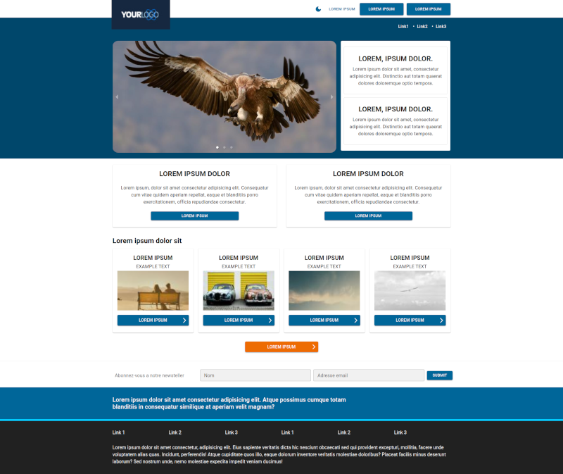

# IGT RRA02645 - developer's task

## Description

Please find the attached one page mock of desktop and mobile versions. This should be done responsive and might be different on tablet.

Develop this in React using Material UI (https://mui.com/) and add Theming (Theme 1 and Theme 2 – so we can switch the theme of styles).

Please send back to this email with completed task. If any install is required, please update README accordingly.

Feel free to use images of your own choice. You can use less, sass or styled components.

A bonus would be lazy mock data loading and use of mui skeleton (Optional).

You can use CRA (Create React App) as a base, if required.

## Done

-   [x] responsive landing page
-   [x] react, mui, theming implemented
-   [x] README.md fullfilled
-   [x] styled-components package used
-   [x] mui Skeleton used
-   [x] CRA used

## TODO

No TODOs. All requirements fulfilled.

## Get started

Clone repo

```
git clone {repo-link}
```

In the project directory, install dependiences

```
npm install
```

In the project directory, you can run:

```
npm start
```

If the browser doesn't start automatically go to http://localhost:3000/

Use 🌜/🎨 checkbox to change themes.

## Current state of GUI

### Desktop version.
_Default theme_



_Dark theme_

Screenshot [here](desktop-bw.png).

### Mobile version

Screenshot [here](mobile.png).

## Available Scripts

In the project directory, you can run:

### `npm start`

Runs the app in the development mode.\
Open [http://localhost:3000](http://localhost:3000) to view it in the browser.

The page will reload if you make edits.\
You will also see any lint errors in the console.

### `npm test`

Launches the test runner in the interactive watch mode.\
See the section about [running tests](https://facebook.github.io/create-react-app/docs/running-tests) for more information.

### `npm run build`

Builds the app for production to the `build` folder.\
It correctly bundles React in production mode and optimizes the build for the best performance.

The build is minified and the filenames include the hashes.\
Your app is ready to be deployed!

See the section about [deployment](https://facebook.github.io/create-react-app/docs/deployment) for more information.
